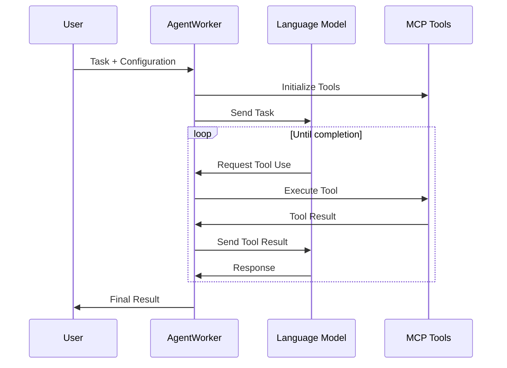

# Agentic MCP Client

<p>
  <a href="LICENSE"></a>
</p>

A standalone agent runner that executes tasks using MCP (Model Context Protocol) tools via Anthropic Claude, AWS BedRock and OpenAI APIs. It enables AI agents to run autonomously in cloud environments and interact with various systems securely.

## Current Features

- Run standalone agents with tasks defined in JSON configuration files
- Support for both Anthropic Claude and OpenAI models
- Automatic tool discovery and execution
- Session logging for tracking agent progress
- Configurable system prompts and model parameters
- Support for MCP sampling
- Maximum iteration control to prevent infinite loops

## Installation

1. **Clone the repository**

2. **Set up dependencies:**
```bash
uv sync
```

3. **Create an agent_worker_task.json file**

Here is an example configuration file:
```json
{
    "task": "Find all image files in the current directory and tell me their sizes",
    "model": "claude-3-7-sonnet-20250219",
    "system_prompt": "You are a helpful assistant that completes tasks using available tools.",
    "verbose": true,
    "max_iterations": 10
}
```

4. **Run the agent:**
```bash
uv run agentic_mcp_client/agent_worker/run.py
```

## Configuration
The project requires a `config.json` file in the root directory to define the inference server settings and available MCP tools. Here's an example configuration:

```json
{
   "inference_server": {
      "base_url": "https://api.anthropic.com/v1/",
      "api_key": "YOUR_API_KEY_HERE",
      "use_bedrock": true,
      "aws_region": "us-east-1",
      "aws_access_key_id": "YOUR_AWS_ACCESS_KEY",
      "aws_secret_access_key": "YOUR_AWS_SECRET_KEY"
   },
   "mcp_servers": {
    "mcp-remote-macos-use": {
      "command": "docker",
      "args": [
        "run",
        "-i",
        "-e",
        "MACOS_USERNAME=your_username",
        "-e",
        "MACOS_PASSWORD=your_password",
        "-e",
        "MACOS_HOST=your_host_ip",
        "--rm",
        "buryhuang/mcp-remote-macos-use:latest"
      ]
    },
    "mcp-my-apple-remembers": {
      "command": "docker",
      "args": [
        "run",
        "-i",
        "-e",
        "MACOS_USERNAME=your_username",
        "-e",
        "MACOS_PASSWORD=your_password",
        "-e",
        "MACOS_HOST=your_host_ip",
        "--rm",
        "buryhuang/mcp-my-apple-remembers:latest"
      ]
    }
  }
}
```

### Configuration Sections

#### Inference Server
The `inference_server` section configures the connection to your language model provider:
- `base_url`: The API endpoint for your chosen LLM provider
- `api_key`: Your authentication key for the LLM service
- `use_bedrock`: Set to true to use Amazon Bedrock for model inference
- AWS credentials (when using Bedrock)

#### MCP Servers
The `mcp_servers` section defines available MCP tools. Each tool has:
- A unique identifier (e.g., "mcp-remote-macos-use")
- `command`: The command to execute (typically Docker for containerized tools)
- `args`: Configuration parameters for the tool

This example shows MCP tools for remotely controlling a macOS system through Docker containers.

## How MCP Works

The Model Context Protocol provides a standardized way for applications to:
- Share contextual information with language models
- Expose tools and capabilities to AI systems
- Build composable integrations and workflows

The protocol uses JSON-RPC 2.0 messages to establish communication between hosts (LLM applications), clients (connectors within applications), and servers (services providing context and capabilities).

Our agent worker implements this workflow:
1. Initialize MCP clients for all available tools
2. Send the initial task message to the selected model
3. Process model responses (either tool calls or text)
4. If a tool call is made, execute the tool and send the result back to the model
5. Repeat until the task is completed or maximum iterations reached
6. Shut down all MCP clients



## Contribution Guidelines
Contributions to Agentic MCP Client are welcome! To contribute, please follow these steps:
1. Fork the repository.
2. Create a new branch for your feature or bug fix.
3. Make your changes and commit them.
4. Push your changes to your fork.
5. Create a pull request to the main repository.

## Acknowledgments

This project was inspired by and builds upon the work the excellent open-source projects in the MCP ecosystem:

- [MCP-Bridge](https://github.com/SecretiveShell/MCP-Bridge) - A middleware that provides an OpenAI-compatible endpoint for calling MCP tools, which helped inform our approach to tool integration and standardization.

We are grateful to the contributors of these projects for their pioneering work in the MCP space, which has helped make autonomous agent development more accessible and powerful.

## License
Agentic MCP Client is licensed under the Apache 2.0 License. See the [LICENSE](LICENSE) file for more information.